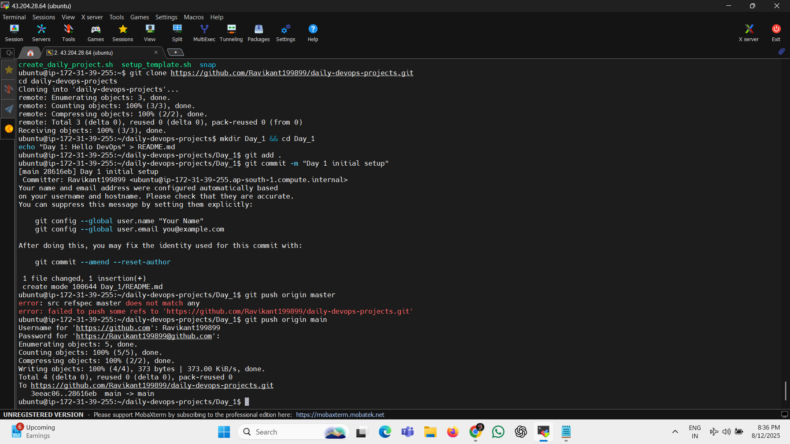

# 📅 Day 1 — Hello DevOps

## 🎯 Goal
Set up the foundation for my DevOps journey:
- Create a GitHub repository for daily projects
- Prepare an EC2 instance for development
- Push the first commit from EC2 to GitHub

---

## 🛠 Steps Completed

### 1️⃣ Create GitHub Repository
- **Name:** `daily-devops-projects`
- **Description:** My daily DevOps learning and projects journey — one project a day.
- Set to **Public**
- Initialized with an empty README.md

---

### 2️⃣ Launch EC2 Instance
- **Type:** Ubuntu 22.04 LTS, `t2.micro` (Free Tier)
- Connected via SSH:
```bash
ssh -i your-key.pem ubuntu@<EC2_PUBLIC_IP>
```

Updated packages:
```
sudo apt update && sudo apt upgrade -y
```

3️⃣ Install and Configure Git
```
sudo apt install git -y
git config --global user.name "Your Name"
git config --global user.email "your-email@example.com"
```

4️⃣ Link EC2 to GitHub Repo
```
git clone https://github.com/<your-username>/daily-devops-projects.git
cd daily-devops-projects
mkdir Day_1 && cd Day_1
echo "Day 1: Hello DevOps" > README.md
git add .
git commit -m "Day 1: Initial setup"
git push origin main
```

📸 Screenshot


📚 Key Learnings
How to launch and connect to an EC2 instance

Installing and configuring Git on Linux

Cloning and pushing to GitHub from a remote server

